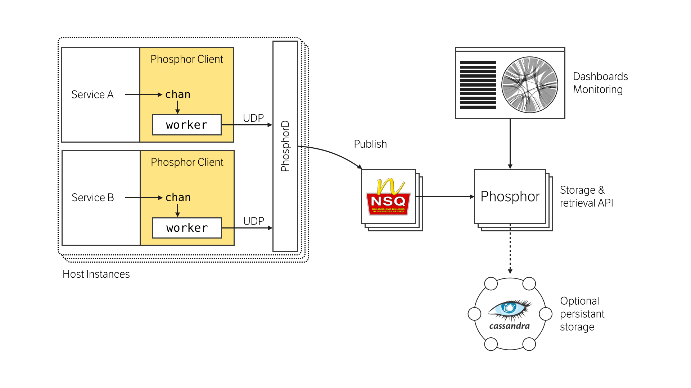

Phosphor is a Distributed Tracing system, similar to [Google's Dapper](https://research.google.com/pubs/pub36356.html),  [Twitter's Zipkin](https://twitter.github.io/zipkin), and [Hailo's Trace Service](https://speakerdeck.com/mattheath/scaling-microservices-in-go-high-load-strategy-2015?slide=45).

It is comprised of a few simple components:

 - Phosphor Client, used to send traces from applications
 - [Phosphor Daemon](https://github.com/mondough/phosphor/tree/master/phosphord), collects traces and forwards onto the main server
 - [Phosphor Server](https://github.com/mondough/phosphor/tree/master/phosphor), stores traces and aggregated trace information
 - Phosphor UI, view trace and debug information about your infrastructure

## Dependencies

 - [NSQ](https://nsq.io) is used as the delivery transport between PhosphorD and the Phosphor Server

## Caveats

This system is currently in development, and some components are not yet open source. In particular, the persistence layer in this repository is an in-memory mock, and is therefore not appropriate for production usage. Additional storage adaptors will be added in the near future.
